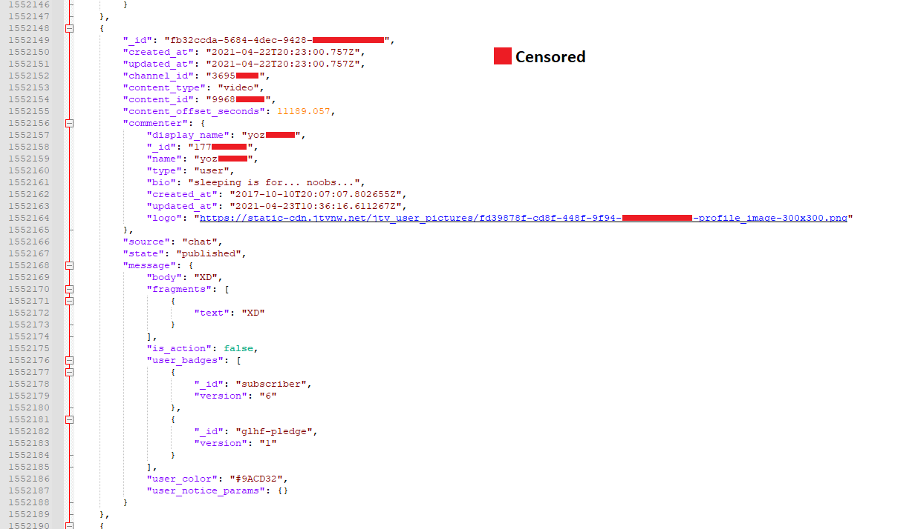

# twitch-comments-downloader

## Description

Simple python script that allows downloading comments data for video from twitch.tv.

Data contains all information that come from twitch.tv (emotes, badges, comment text, timestamp etc.) - nothing is changed. Thus generated file is kinda big and should be processed further based on your needs (for example extracting only message body and username).

By combining it with `youtube-dl` you can fully backup your VODs also with comments data.

## Requirements

Just `python3`. No additional external libraries are used - only builtin ones.

## Usage

**Run**

```bash
./twitch-comments-downloader.py VOD_URL
```

**For example**

```bash
https://www.twitch.tv/videos/123456789
```
The JSON file is generated in current directory with name `{VIDEO_ID}.json`.

**In case of errors during usage**

Just rerun `./twitch-comments-downloader.py VOD_URL` - thanks to using `_cache` all responses are cached and only neede data will be downloaded - script will read all cached responses and resume downloading from the first error.

## Example output



